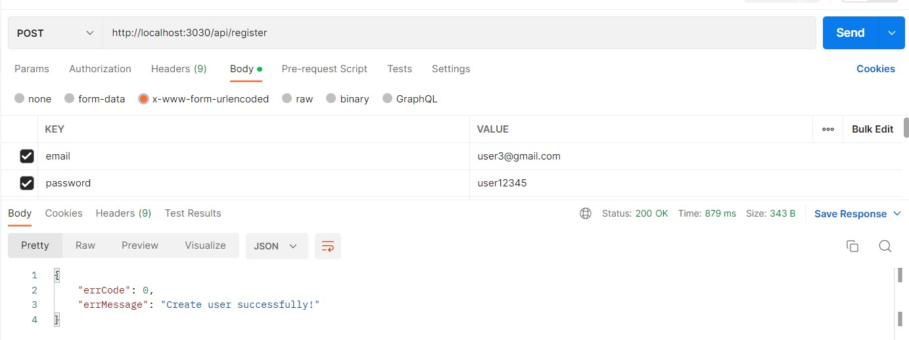
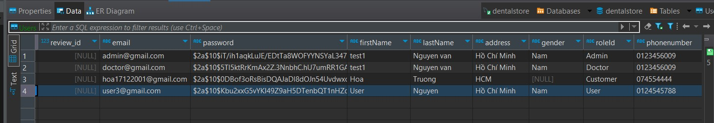

<p align="center">
  <a href="http://nestjs.com/" target="blank"></a>
  <a href="http://nestjs.com/" target="blank"></a>
</p>

  <p align="center">A progressive <a href="http://nodejs.org" target="_blank">Node.js</a> framework for building efficient and scalable server-side applications.</p>
    

## Description

This Node.js project is designed to provide reset APIs to the [web deploy](https://frontend-dental-store.vercel.app/) and repo [FrontendDentalStore](https://github.com/minnku17/FrontendDentalStore).

The project utilizes the ORM Sequelize for querying the MySQL database. This allows for easy database management and query optimization.

In addition to MySQL, the project also utilizes JWT for granular authentication and authorization.

The main objective of this project is to support various functionalities for an online e-commerce website. The following features are supported by this project:
```
User authentication and authorization 

User management (create, read, update, delete)

Category management (create, read, update, delete)

Brand management (create, read, update, delete)

Product management (create, read, update, delete)

Order management (create, read, update)

Filtering of products based on various criteria

Sales revenue tracking by day and month

Bestselling product tracking

The project follows the best practices for Node.js development and adheres to a modular design pattern.
This allows for easy scalability and maintainability of the codebase.
```
Technologies used in this project include:
```
Node.js

Sequelize ORM

MySQL database

JWT
```
## Installation

```bash
$ npm install
```

## Running the app

```bash
# development
$ npm start
```

## Demo RestAPI in Postman
<p>Api: Register user</p>

 Postman

Database


<!-- ## Support

Nest is an MIT-licensed open source project. It can grow thanks to the sponsors and support by the amazing backers. If you'd like to join them, please [read more here](https://docs.nestjs.com/support). -->

## Stay in touch

- Author - [Truong Thanh Hoa](https://github.com/minnku17)
- Website - [https://frontend-dental-store.vercel.app](https://frontend-dental-store.vercel.app/)
<!-- - Twitter - [@nestframework](https://twitter.com/nestframework) -->
<!-- 
## License

Nest is [MIT licensed](LICENSE). -->
